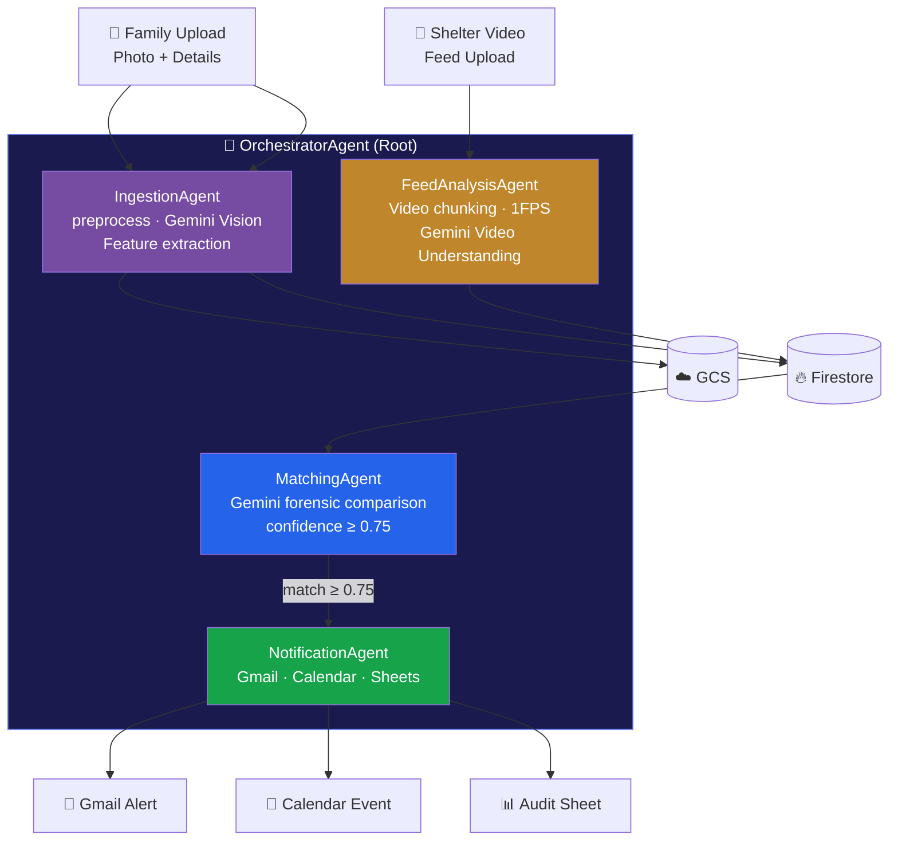

# 🔍 VisualLink: Missing Person Reunification Hub

> **Humanitarian AI system** that reunites displaced families by matching
> uploaded photos of missing persons against shelter security camera feeds —
> powered by **Google Gemini Vision** and **Google ADK**.

---

## Architecture



---

## Features

| Feature | Details |
|---|---|
| 🖼️ Image preprocessing | CLAHE denoise + contrast boost + Lanczos upscaling |
| 🤖 Gemini Vision extraction | Face, hair, clothing, age, skin tone, distinguishing marks |
| 🎬 Video Understanding | 30s chunks · 1 FPS sampling · Gemini multimodal |
| 🔬 Forensic matching | Structured Gemini comparison prompt → 0.0–1.0 confidence |
| 📧 Gmail alerts | Rich HTML email with match details + Google Maps link |
| 📅 Calendar events | Auto-created for case worker with 1-hour reminder |
| 📊 Audit trail | Every match appended to Google Sheets for compliance |
| 🔥 Firestore storage | Structured NoSQL schema for cases, sightings, matches |
| 🌐 Streamlit UI | 3-tab app: report · operator portal · case dashboard |

---

## Project Structure

```
visuallink/
├── app.py                        # Streamlit frontend (3 tabs + system info)
├── config.py                     # Settings from environment variables
├── adk.yaml                      # ADK multi-agent topology config
├── firestore_setup.py            # Schema seeding + index generation
├── requirements.txt
├── .env.example                  # Environment variable template
│
└── agents/
    ├── __init__.py
    ├── orchestrator_agent.py     # Root coordinator (3 workflows)
    ├── ingestion_agent.py        # Photo → features → Firestore
    ├── feed_analysis_agent.py    # Video → sightings → Firestore
    ├── matching_agent.py         # Cross-comparison → confirmed matches
    └── notification_agent.py    # Gmail + Calendar + Sheets
```

---

## Firestore Schema

```
missing_persons/{case_id}
  ├── case_id, name, age, contact_email, last_known_location
  ├── photo_gcs_url             → gs://bucket/missing_persons/{case_id}/photo.jpg
  ├── features                  → {face_description, hair, clothing_top, …}
  ├── submitted_at (ISO 8601)
  └── status                    → "active" | "resolved"

shelter_sightings/{feed_id}/sightings/{sighting_id}
  ├── shelter_name, shelter_location, feed_gcs_url
  ├── timestamp_seconds         → seconds from start of feed
  ├── features                  → {face_description, hair, clothing_top, …}
  └── confidence_of_extraction  → float 0.0–1.0

matches/{match_id}
  ├── case_id, sighting_id, feed_id
  ├── match_confidence          → float 0.0–1.0
  ├── match_reasoning           → 2–3 sentence Gemini explanation
  ├── key_matched_features      → list
  ├── key_discrepancies         → list
  └── notification_status       → "pending" | "sent"
```

---

## Setup & Installation

### Prerequisites

- Python 3.11+
- Google Cloud project with Firestore, Cloud Storage enabled
- Google Workspace with Gmail, Calendar, Sheets APIs enabled
- Service account with domain-wide delegation (for Workspace APIs)
- Gemini API key from [Google AI Studio](https://aistudio.google.com)

### 1. Clone & Install

```bash
git clone https://github.com/your-org/visuallink.git
cd visuallink
python -m venv .venv && source .venv/bin/activate
pip install -r requirements.txt
```

### 2. Configure Environment

```bash
cp .env.example .env
# Edit .env with your real credentials
```

Required `.env` values:

| Variable | Description |
|---|---|
| `GEMINI_API_KEY` | Your Gemini API key |
| `GCP_PROJECT_ID` | Google Cloud project ID |
| `GCS_BUCKET_NAME` | GCS bucket for media storage |
| `GOOGLE_SERVICE_ACCOUNT_FILE` | Path to service account JSON |
| `GOOGLE_WORKSPACE_DELEGATED_USER` | Admin user for Workspace impersonation |
| `NOTIFICATION_SENDER_EMAIL` | Gmail sender address |
| `CASE_WORKER_EMAIL` | Case worker's Calendar invite recipient |
| `AUDIT_SHEET_ID` | Google Sheets spreadsheet ID |

### 3. Set Up Firestore

```bash
# Set GCP credentials
export GOOGLE_APPLICATION_CREDENTIALS=./service_account.json

# Seed schema and generate index config
python firestore_setup.py

# Deploy indexes via Firebase CLI
firebase deploy --only firestore:indexes
```

### 4. Enable Google Cloud APIs

```bash
gcloud services enable \
  firestore.googleapis.com \
  storage.googleapis.com \
  gmail.googleapis.com \
  calendar-json.googleapis.com \
  sheets.googleapis.com
```

### 5. Run the Application

```bash
streamlit run app.py
```

Navigate to `http://localhost:8501` 🎉

---

## Using the Application

### Workflow A — Report a Missing Person

1. Go to **"📸 Report Missing Person"** tab
2. Upload photo(s) (blurry/low-quality OK — preprocessing handles it)
3. Fill in name, age, last known location, contact email
4. Click **"Submit Report"**
5. `IngestionAgent` preprocesses + extracts features → stored in Firestore
6. `MatchingAgent` automatically cross-matches against all shelter sightings
7. If confidence ≥ 75%: `NotificationAgent` sends Gmail + creates Calendar event

### Workflow B — Upload Shelter Feed (Operator Portal)

1. Go to **"📹 Shelter Operator Portal"** tab
2. Enter shelter name + address
3. Upload security footage (MP4/MOV up to 500 MB)
4. `FeedAnalysisAgent` chunks video → Gemini analyzes each 30s segment
5. All active missing-person cases are automatically matched against new sightings

### Workflow C — Check Case Status

1. Go to **"🔎 Case Status Dashboard"** tab
2. Enter your Case ID (received after submission)
3. View match history, confidence scores, reasoning, and shelter location on an embedded map

---

## ADK Multi-Agent Configuration

The `adk.yaml` file defines the complete agent topology:

```yaml
model:
  name: gemini-1.5-flash    # or gemini-1.5-pro for higher accuracy
  parameters:
    temperature: 0.1         # Low for deterministic JSON extraction

pipeline:
  match_confidence_threshold: 0.75
  video_chunk_seconds:        30
  video_sample_fps:           1
```

To switch to Gemini Pro for higher accuracy:
```bash
# In .env:
GEMINI_MODEL=gemini-1.5-pro
```

---

## Gemini Prompting Strategy

All agents use **structured JSON output** via `response_mime_type: application/json`:

| Agent | Prompt Goal | Output |
|---|---|---|
| `IngestionAgent` | Extract 7-field person descriptor | JSON object |
| `FeedAnalysisAgent` | Detect all persons in video chunk | JSON array |
| `MatchingAgent` | Forensic binary comparison | JSON with confidence score |

---

## Privacy & Ethics

> ⚠️ **Important**: This system processes biometric data (facial features).

- All data is stored in your own GCP project — no data leaves your infrastructure
- Use Firebase Authentication to restrict access to authorized users only
- Comply with local biometric data privacy laws (GDPR, CCPA, BIPA)
- Implement data retention policies — auto-delete cases after resolution
- Match results are advisory only — always require human verification

---

## License

MIT License — for humanitarian, non-commercial use.

---

*Built with ❤️ using Google Gemini, Google ADK, Firebase, and Google Workspace*
